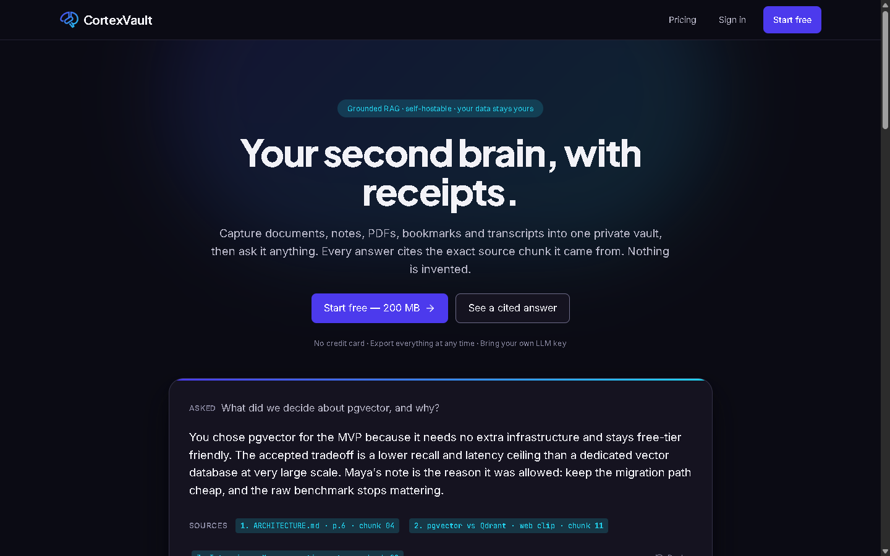
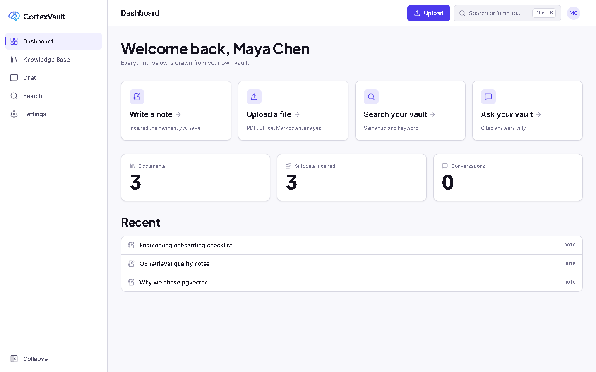
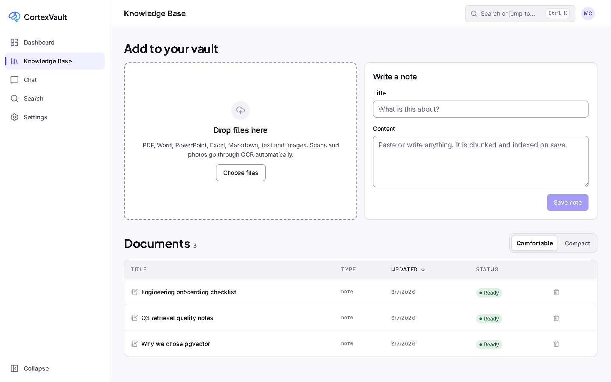
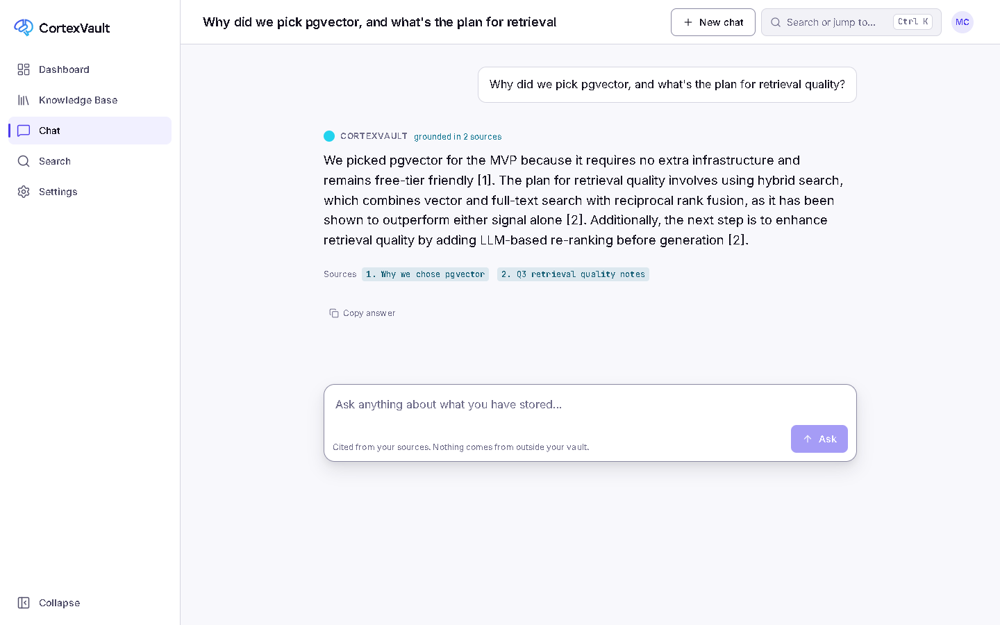
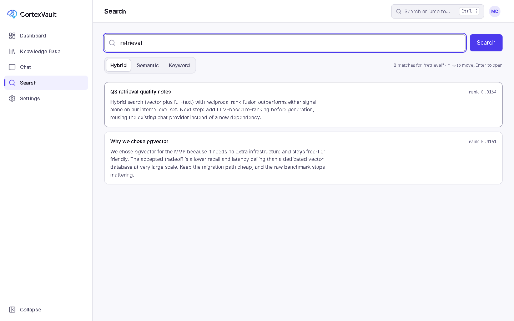
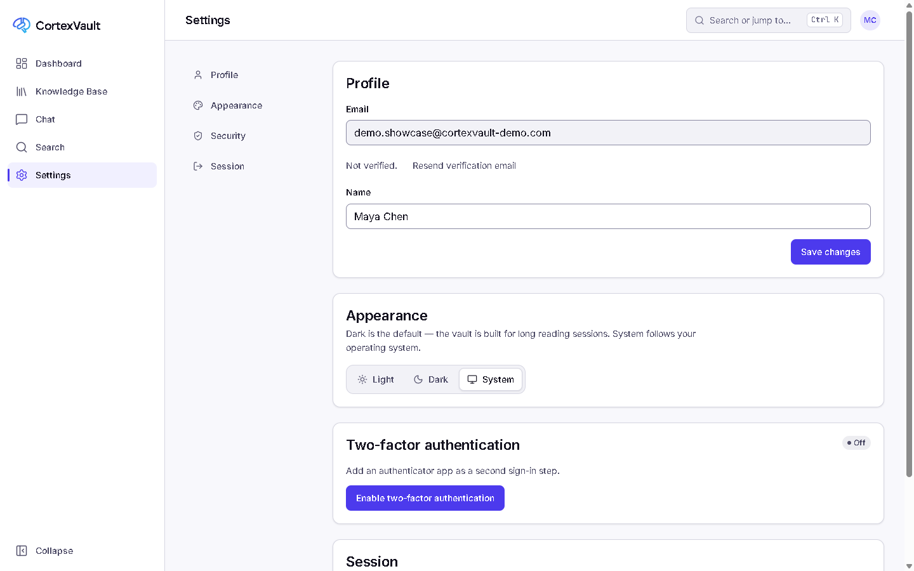

# CortexVault

**Your knowledge. Instantly recalled.**

[](https://github.com/dooddles07/Cortex-Vault/actions/workflows/ci.yml)
[](LICENSE)
[](https://cortex-vault-web.vercel.app)

CortexVault is an AI-powered second brain built on Retrieval-Augmented Generation (RAG). Collect documents, PDFs, notes, web pages, code, and more — then search and chat with your own knowledge using an assistant that answers only from what you've stored.



<details>
<summary>More screenshots — dashboard, knowledge base, chat, search, settings</summary>

| | |
|---|---|
|  |  |
|  |  |



All captured live against production — real sign-up, real ingested notes, a real hybrid search, a real cited chat answer.

</details>

> **Status:** Live in production. Backend and frontend are both fully wired — auth (with MFA), documents, folders, tags, collections, favorites, hybrid search with filters, trash retention, and RAG chat all ship and are verified end-to-end. Ingestion handles PDF, `.docx`/`.pptx`/`.xlsx`, and OCR for scans/images; object storage is optional (Cloudflare R2). Nothing left unbuilt from the P0 (MVP) list — remaining gaps are P1/P2 features and documented engineering debt; see [ROADMAP.md](docs/ROADMAP.md) for the honest list.

## Why CortexVault

Think Notion + Obsidian + NotebookLM + Perplexity, with your data staying yours.

- **Capture anything** — notes, PDFs, web clips, images (OCR), YouTube transcripts, code snippets, meeting notes, research papers
- **AI chat over your own data** — cited, grounded answers, no hallucinated sources
- **Hybrid search** — semantic + keyword + re-ranking
- **Auto-organization** — tagging, folder suggestions, duplicate detection, knowledge graph
- **Privacy-first** — self-hostable, bring-your-own LLM key, local embedding option (Ollama)

## Documentation

| Doc | Covers |
|---|---|
| [PROJECT-OVERVIEW](docs/PROJECT-OVERVIEW.md) | Vision, personas, competitor analysis, business model |
| [FEATURES](docs/FEATURES.md) | Full feature catalog — purpose, flow, API, DB impact, priority |
| [ROADMAP](docs/ROADMAP.md) | What is shipped, what is missing, engineering debt |
| [ARCHITECTURE](docs/ARCHITECTURE.md) | System design as built, diagrams, structure, known gaps |
| [TECH-STACK](docs/TECH-STACK.md) | Every technology choice and its rationale |
| [API](docs/API.md) | Endpoint reference, auth, SSE chat contract |
| [DATABASE](docs/DATABASE.md) | Schema, indexes, cascades, migrations |
| [RAG](docs/RAG.md) | Chunking, embedding, hybrid retrieval, generation |
| [AI](docs/AI.md) | Provider adapters, model availability, cost and privacy |
| [SECURITY](docs/SECURITY.md) | What is enforced, and the pre-production gap list |
| [TESTING](docs/TESTING.md) | Local setup, test layers, deployment verification |
| [DEPLOYMENT](docs/DEPLOYMENT.md) | Vercel + Render + Neon setup, cold starts, failure modes |
| [DESIGN](docs/DESIGN.md) · [UI-UX](docs/UI-UX.md) | Design tokens, component system, screens |
| [CHANGELOG](docs/CHANGELOG.md) | What shipped, by day |

## Stack

Next.js 15 + TypeScript + Tailwind 4 · FastAPI (Python 3.12) · Postgres + pgvector · SQLAlchemy 2 + Alembic · Groq (chat) + Gemini (embeddings), with OpenAI and Ollama adapters · Vercel + Render + Neon

Full rationale — including why the backend is Python rather than the originally planned TypeScript — in [TECH-STACK.md](docs/TECH-STACK.md).

## Live

- App — [cortex-vault-web.vercel.app](https://cortex-vault-web.vercel.app)
- API — [cortexvault-api.onrender.com](https://cortexvault-api.onrender.com) · [`/docs`](https://cortexvault-api.onrender.com/docs)

Runs entirely on free tiers. The API sleeps after 15 minutes idle, so the first request after a quiet period takes ~50 seconds.

## Quick start

```bash
cd apps/server
docker compose up -d          # Postgres + pgvector, Redis
cp .env.example .env          # set GEMINI_API_KEY
pip install -e ".[dev]"
alembic upgrade head
uvicorn app.main:app --reload
```

See [TESTING.md](docs/TESTING.md) for the worker, the frontend, and deployment verification.

## License

[MIT](LICENSE) © 2026 QUAN7UM
