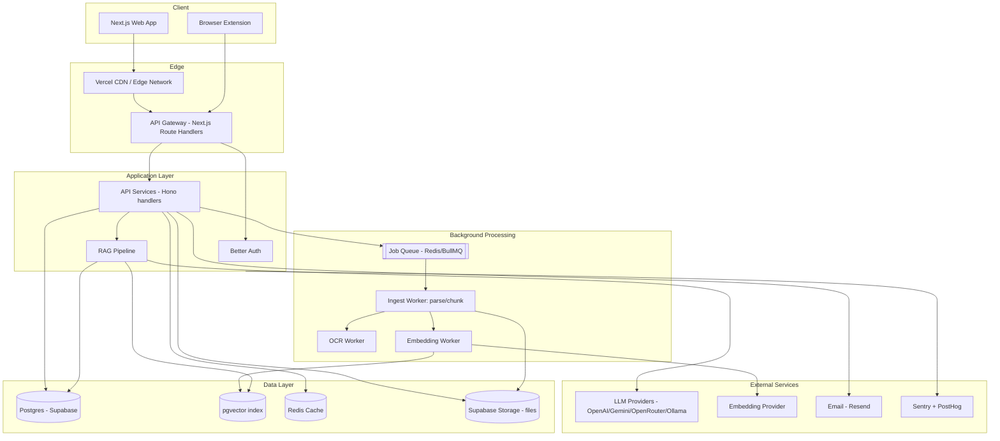
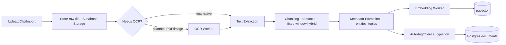
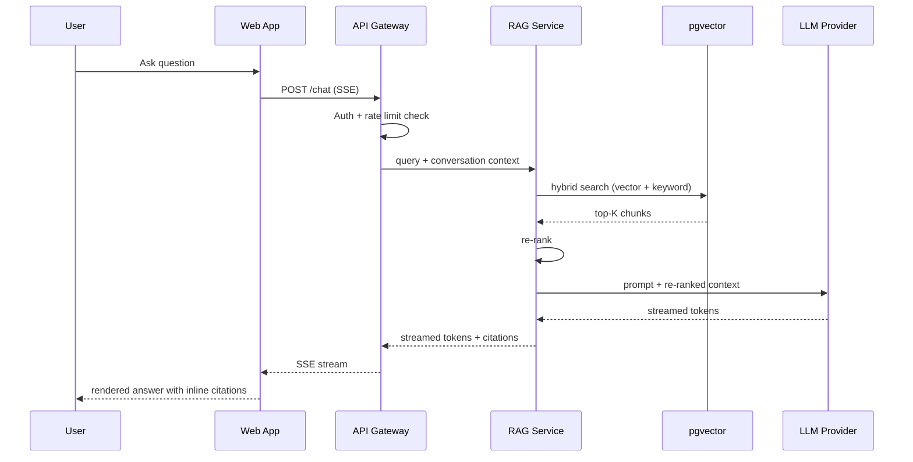

# Architecture

## Executive Summary

CortexVault is a single Next.js application (frontend + API routes) backed by Postgres/pgvector, with async workers handling ingestion (parsing, OCR, chunking, embedding). Everything ships as one deployable unit at MVP scale; infra-heavy pieces (embeddings, OCR, transcription) are isolated behind a job queue from day one so they can be peeled into standalone services without touching the app layer.

## Goals

- One deploy target (Vercel) at MVP; no premature microservices
- Ingestion pipeline decoupled from the request/response cycle via a queue — uploads never block on OCR/embedding
- Every AI answer traceable to source chunks (no ungrounded generation)
- Scale path from single-tenant free tier to multi-tenant workspaces without a schema rewrite

## High-Level Architecture



## Component Breakdown

| Layer | Technology | Responsibility |
|---|---|---|
| Frontend | Next.js (App Router) + React + TypeScript | SSR shell, client interactivity, streaming chat UI |
| API Gateway | Next.js Route Handlers | Auth check, rate limiting, request validation, routing to services |
| Backend services | Hono (mounted inside route handlers) | Business logic: documents, folders, search, chat orchestration |
| ORM | Prisma | Type-safe DB access, migrations |
| Primary DB | Postgres (Supabase) | Users, documents, metadata, relational integrity |
| Vector index | pgvector (same Postgres instance) | Embedding storage + cosine/HNSW similarity search |
| Cache | Redis (Upstash) | Session cache, rate-limit counters, hot search results |
| Object storage | Supabase Storage | Original files (PDFs, images, audio) |
| Queue | Redis-backed (BullMQ) | Decouples upload from parse/OCR/embed |
| Workers | Node workers (separate process/deployment) | Ingest, OCR (Tesseract/cloud OCR), embedding generation, transcript fetch |
| Auth | Better Auth | Session/JWT issuance, OAuth, MFA |
| AI providers | OpenAI, Gemini, OpenRouter, Ollama (local) | Chat completion, embeddings; provider-agnostic adapter |
| Monitoring | Sentry | Error tracking, performance tracing |
| Analytics | PostHog | Product usage, funnels |
| Email | Resend (or equivalent) | Verification, notifications, digests |
| CDN | Vercel Edge Network | Static assets, edge caching |
| Deployment | Vercel (app) + Railway/Fly.io (workers) | Split so long-running workers don't fight serverless timeouts |

## AI Pipeline — Ingestion (Data Flow)



Full chunking/embedding parameters live in [RAG.md](RAG.md) once written; this diagram fixes the pipeline shape so worker contracts (queue payloads, retry semantics) can be built now.

## AI Pipeline — Chat Request (Sequence)



## Failure Handling

| Failure | Handling |
|---|---|
| Embedding provider timeout/5xx | Job retried with exponential backoff (3 attempts), then dead-letter queue + user notification |
| LLM provider outage | Automatic fallback to secondary provider (config-driven priority list); Ollama as last-resort local fallback |
| OCR failure | Document marked `ingest_status=failed_ocr`, raw file still searchable via filename/metadata, user can retry |
| Partial chunk embedding failure | Per-chunk retry, not whole-document; document usable with partial index + banner noting incomplete indexing |
| Queue backlog | Priority lanes (interactive re-index > new upload > bulk import) so single large import doesn't starve chat latency |

## Rate Limiting

- Token-bucket per user at the API gateway (Redis-backed), scoped separately for: general API, AI chat, uploads
- Free tier: stricter AI-message and upload-size caps; Pro/Team: higher ceilings; overage on metered plans logged to `usage_events` for billing
- Per-IP limits on unauthenticated endpoints (auth, public share links) to blunt credential stuffing/scraping

## Caching Strategy

- Redis: session lookups, rate-limit counters, last-N search results per user (short TTL)
- HTTP cache headers + CDN edge caching for public/static assets and public share pages
- Embedding cache: identical content hash skips re-embedding (dedupe on `content_hash`)

## Scalability Strategy

| Stage | Approach |
|---|---|
| 0 → 10k users | Single Postgres (Supabase), single worker deployment, vertical scaling |
| 10k → 100k users | Read replicas for search-heavy reads, dedicated worker fleet autoscaled on queue depth, pgvector HNSW tuning |
| 100k+ users | Consider dedicated vector DB (Qdrant/Pinecone) if pgvector recall/latency ceiling hit; shard by workspace |
| Enterprise/VPC | Isolated deployment per tenant or dedicated schema-per-tenant, optional on-prem workers |

## Future Microservices Split

Not done at MVP — called out here so boundaries are drawn correctly from the start:

- **Embedding/OCR/transcription workers** — already isolated behind the queue; promote to their own repo/service when worker deploys need independent scaling from the ingest worker
- **AI Gateway service** — if multi-provider routing/cost-optimization logic grows complex, extract from `packages/ai` into its own service with its own rate limits
- **Search service** — only if/when vector DB is swapped out from pgvector to a dedicated engine

## Project Structure

Monorepo (Turborepo), so `apps/web` and `apps/workers` share `packages/*` without duplication.

```
cortexvault/
├── apps/
│   ├── web/                 # Next.js app: UI + API route handlers
│   │   ├── app/              # App Router pages/layouts/route handlers
│   │   ├── components/       # App-specific composed components
│   │   ├── features/         # Feature-sliced modules (chat/, documents/, search/...)
│   │   ├── hooks/             # React hooks
│   │   ├── server/            # Route handler business logic, calls services/
│   │   ├── services/           # Orchestration: composes packages/{db,ai,auth}
│   │   ├── lib/                 # App-local utilities
│   │   ├── emails/               # React Email templates
│   │   ├── public/                # Static assets
│   │   └── types/                  # App-local types
│   └── workers/               # Standalone worker process (ingest/OCR/embed/transcribe)
│       └── src/jobs/
├── packages/
│   ├── db/                   # Prisma schema, client, migrations
│   ├── ai/                    # RAG pipeline: chunking, embeddings, retrieval, prompts, provider adapters
│   ├── auth/                   # Better Auth config + shared helpers
│   ├── ui/                      # Shared shadcn/ui component library
│   ├── utils/                    # Cross-package pure utilities
│   └── config/                    # Shared eslint/tsconfig/tailwind/vitest config
├── docs/                      # This blueprint
├── scripts/                   # One-off/maintenance scripts (backfills, seed data)
├── tests/                     # Playwright E2E suite
└── turbo.json / pnpm-workspace.yaml
```

| Folder | Why it exists |
|---|---|
| `apps/web` vs `apps/workers` | Serverless (Vercel, short timeout) can't run long OCR/embedding jobs — split deploy targets from day one |
| `packages/db` | Single Prisma schema shared by web + workers, no drift |
| `packages/ai` | RAG logic is the product's core IP — isolated so it's independently testable and swappable per provider |
| `features/` (feature-sliced) | Scale UI code by domain (chat, documents, search) instead of by type, avoids giant shared `components/` |
| `packages/config` | One source of truth for lint/type/style rules across apps and packages |

## Risks & Tradeoffs

- **pgvector vs dedicated vector DB**: chosen for zero extra infra + free-tier friendliness; accepted tradeoff is a lower recall/latency ceiling than Pinecone/Qdrant at very large scale — mitigated by the swap-out path above
- **Serverless app + separate worker deploy**: two deploy targets instead of one; accepted because long-running ingestion jobs are incompatible with Vercel function timeouts
- **Single Postgres for relational + vector**: simpler ops, fewer moving parts; revisit only if data shows pgvector is the bottleneck, not preemptively

## Checklist (pre-implementation)

- [ ] Confirm Supabase project + pgvector extension enabled
- [ ] Define BullMQ queue names/payload contracts before first worker is written
- [ ] Provider adapter interface in `packages/ai` fixed before wiring OpenAI/Gemini/Ollama
- [ ] Rate-limit keys/buckets defined before `/chat` ships
- [ ] Turborepo pipeline (`build`/`dev`/`lint`/`test`) configured before second app is added
