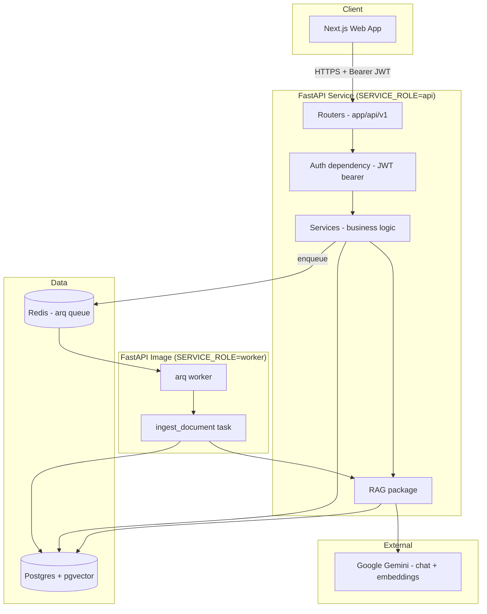
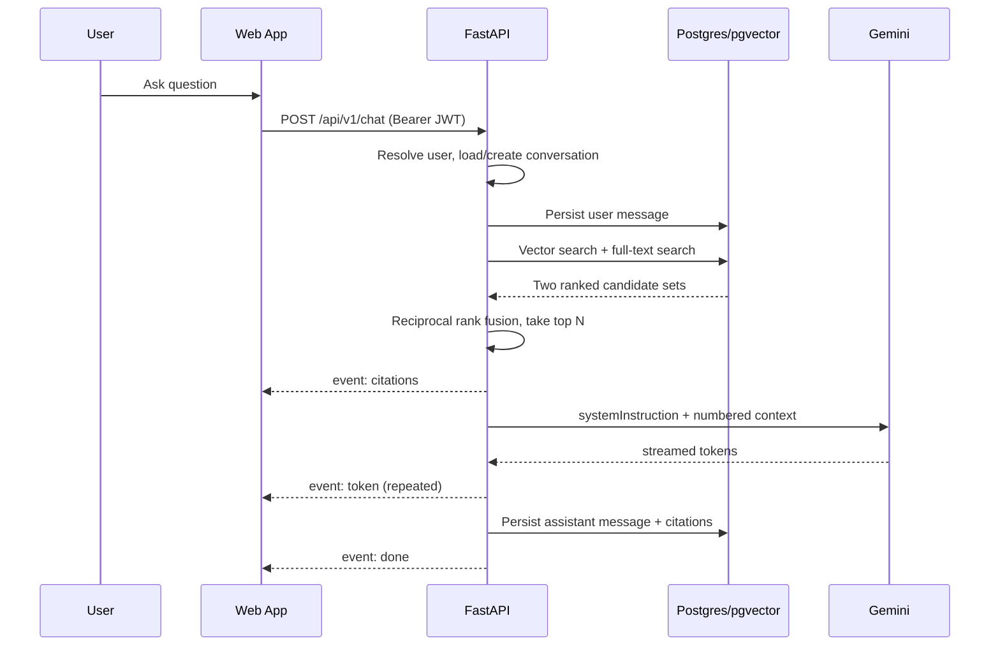

# Architecture

> **Status:** Implemented and deployed. This document describes the system as built, not as planned. An earlier revision described an all-TypeScript backend (Hono handlers inside Next.js route handlers, Node workers); that design was replaced by a standalone Python/FastAPI service before implementation. See [TECH-STACK.md](TECH-STACK.md) for why.

## Executive Summary

CortexVault is a Next.js frontend talking to a standalone FastAPI backend, backed by Postgres with pgvector. Ingestion (chunking and embedding) runs out-of-band in an arq worker so uploads never block on embedding generation. The API and the worker ship as **one Docker image** that picks its role from a `SERVICE_ROLE` environment variable.

## Goals

- Frontend and backend deploy and scale independently
- Ingestion decoupled from the request/response cycle
- Every AI answer traceable to source chunks — no ungrounded generation
- Provider-agnostic AI: chat and embeddings chosen independently, swappable without touching business logic

## High-Level Architecture



## Component Breakdown

| Layer | Technology | Responsibility |
|---|---|---|
| Frontend | Next.js 15 (App Router), React 19, Tailwind 4 | UI; calls the API via `NEXT_PUBLIC_API_URL` |
| API | FastAPI (Python 3.12) | Routing, validation, auth, SSE streaming |
| Auth | `bcrypt` + `python-jose` (HS256 JWT) | Password hashing, stateless bearer tokens |
| ORM | SQLAlchemy 2.0 async + asyncpg | Type-annotated models, async sessions |
| Migrations | Alembic (sync, psycopg2) | Schema versioning; runs on API boot |
| Database | Postgres 17 + pgvector | Relational data, embeddings, full-text search |
| Queue | Redis + arq | Decouples upload from chunk/embed |
| AI | Google Gemini (adapters for OpenAI, Ollama) | Chat completion and embeddings |
| Deploy | Railway (5 services) | web, api, worker, Postgres, Redis |

## Request Flow — Chat (SSE)



The citations event is emitted **before** any answer token, so the UI can render sources while the answer streams.

## Ingestion Flow


Re-ingesting a document deletes its chunks first, so the task is safe to retry. arq retries up to 3 times; a terminal failure writes the error onto the `jobs` row and sets `ingest_status=failed`.

## Ingestion modes

`INGEST_MODE` selects how ingestion runs. Both paths are real and tested.

| Mode | How it runs | Needs | Use when |
|---|---|---|---|
| `inline` (default) | FastAPI `BackgroundTasks`, in the API process | Postgres only | Free single-service hosting |
| `queue` | arq worker over Redis | Redis + a worker process | Ingestion must scale independently of the API |

Inline is the default because **no free host offers an always-on background worker**. Costs of inline:

- A large document competes with request handling in the same process.
- An API restart mid-ingest loses that job — the document stays at `processing` until re-ingested.
- No automatic retries; queue mode gets 3 from arq.

Rate limiting follows the same optionality: with `REDIS_URL` set it uses Redis, otherwise per-instance in-memory counters. That is correct on one instance and wrong on several — each would enforce its own budget, multiplying the effective limit by the instance count.

## The Single-Image, Two-Role Pattern

`api` and `worker` are the same Docker image. `entrypoint.sh` branches on `SERVICE_ROLE`:

```sh
if [ "$SERVICE_ROLE" = "worker" ]; then
    exec arq app.workers.worker_settings.WorkerSettings
fi
alembic upgrade head
exec uvicorn app.main:app --host 0.0.0.0 --port "${PORT:-8000}"
```

This exists because Railway resolves a service's config file relative to its root directory — both services read the same `apps/server/railway.json`, so they cannot declare different start commands there. Branching inside the image avoids needing a per-service dashboard override, keeping deployment reproducible from the repo.

Migrations run only on the API role, so concurrent workers never race on `alembic upgrade`.

## Project Structure

```
apps/
├── web/                    Next.js app
└── server/                 FastAPI service
    ├── app/
    │   ├── main.py         App factory, CORS, /health
    │   ├── core/           config, security, exceptions, logging
    │   ├── db/             engine, session, declarative base + mixins
    │   ├── models/         SQLAlchemy ORM models
    │   ├── schemas/        Pydantic request/response models
    │   ├── api/
    │   │   ├── deps.py     DbSession, CurrentUser
    │   │   └── v1/         one module per resource
    │   ├── services/       business logic; routers stay thin
    │   ├── rag/            chunking, embeddings, retrieval, prompts
    │   │   └── providers/  Gemini / OpenAI / Ollama behind a Protocol
    │   └── workers/        arq queue, tasks, worker settings
    ├── alembic/            migrations
    └── tests/
packages/                   shared TS config for the web app
docs/                       this documentation
```

| Boundary | Why |
|---|---|
| `api/v1` vs `services/` | Routers do HTTP concerns only; business logic stays testable without a client |
| `rag/` isolated | Retrieval is the product's core IP — independently testable, provider-swappable |
| `rag/providers/` behind `Protocol` | Adding a provider touches one file and a registry entry |
| `schemas/` vs `models/` | Wire contract decoupled from storage; prevents accidental field exposure |

## Failure Handling

| Failure | Behavior |
|---|---|
| Embedding provider error | arq retries 3×; terminal failure writes `jobs.error`, document stays searchable by title |
| Document with no content | `ingest_status=skipped_empty`, no job failure |
| Re-ingest of existing document | Chunks deleted then rebuilt — idempotent |
| Invalid/expired JWT | 401 with `WWW-Authenticate: Bearer` |
| Cross-user resource access | 404, not 403 — avoids confirming the resource exists |

## Known Gaps

These are real limitations of the current build, not future ideas:

- **No OCR.** PDFs with a text layer are extracted and indexed, but scans are detected and parked at `needs_ocr` — they never become searchable.
- **No object storage.** `documents.file_path` exists but nothing writes to it, so the original upload is discarded once text is extracted.
- **Extraction is synchronous.** Parsing happens in the upload request (offloaded to a thread), not the worker, so a very large PDF slows that one request.
- **No rate limiting.** No token bucket at the API layer.
- **No refresh tokens.** Access tokens last 7 days with no revocation path.
- **No email verification or password reset**, despite `email_verified` existing on the model.
- **Single-tenant.** No workspaces, sharing, or roles.

## Scalability Path

| Stage | Approach |
|---|---|
| Now | Single API replica, single worker, one Postgres |
| Growth | Scale API replicas horizontally (stateless); scale workers on queue depth |
| Larger | Postgres read replicas for search; tune HNSW `ef_search` |
| Beyond pgvector | Swap `rag/retrieval.py` for a dedicated vector DB — the rest of the app is unaffected |

## Risks & Tradeoffs

- **Stateless JWT** — no server-side revocation. Acceptable while single-tenant; needs a session table or short-lived tokens + refresh before multi-user.
- **pgvector over a dedicated vector DB** — one less service, no extra cost. Ceiling is lower at very large scale; the retrieval module is the swap point.
- **HNSW index caps at 2000 dimensions** — this is why embeddings are pinned to 768 via `outputDimensionality`, not the provider default of 3072.
- **Free-tier Gemini** — per-day request caps, and Google may train on free-tier API data. Fine for development; revisit before real user documents.
