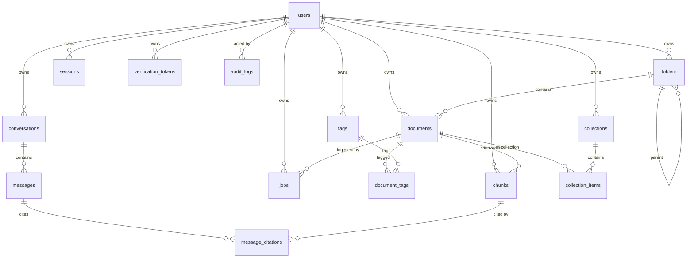

# Database

Postgres 17 with the `vector` extension. Schema is defined by SQLAlchemy models in `apps/server/app/models/` and versioned by Alembic in `apps/server/alembic/versions/`.

## Conventions

Every table except `document_tags` inherits two mixins:

- `UUIDMixin` — `id UUID PRIMARY KEY`, generated application-side via `uuid4()`
- `TimestampMixin` — `created_at`, `updated_at`, both `TIMESTAMPTZ` defaulting to `now()`

`document_tags` is a pure join table with a composite primary key.

## Schema



### users

| Column | Type | Notes |
|---|---|---|
| `email` | `VARCHAR(320)` | Unique, indexed |
| `hashed_password` | `VARCHAR(255)` | bcrypt |
| `name` | `VARCHAR(120)` | Nullable |
| `email_verified` | `BOOLEAN` | Default false. Set by `POST /auth/verify-email`; nothing currently gates on it being true |
| `theme_preference` | `VARCHAR(10)` | `system` \| `light` \| `dark` |
| `failed_login_attempts` | `INTEGER` | Reset to 0 on successful sign-in |
| `locked_until` | `TIMESTAMPTZ` | Nullable. Set on the 5th consecutive failed sign-in; sign-in rejected until this passes |

### documents

| Column | Type | Notes |
|---|---|---|
| `user_id` | FK → users | `ON DELETE CASCADE`, indexed |
| `folder_id` | FK → folders | `ON DELETE SET NULL`, nullable, indexed |
| `type` | `VARCHAR(20)` | `note`, `pdf`, `bookmark`, … |
| `title` | `VARCHAR(500)` | |
| `content` | `TEXT` | Extracted text; null for un-parsed binaries |
| `summary` | `TEXT` | Reserved — nothing writes it yet |
| `source_url`, `file_path` | `TEXT` | `file_path` is the R2 object key, written when `R2_*` is configured; null otherwise |
| `content_hash` | `VARCHAR(64)` | SHA-256, indexed. Backs the embedding cache — an unchanged hash on re-ingest skips re-embedding. See [RAG.md](RAG.md). |
| `ingest_status` | `VARCHAR(30)` | `pending`/`processing`/`indexed`/`needs_ocr`/`unsupported`/`skipped_empty`/`failed` |
| `starred` | `BOOLEAN` | Toggled via `POST`/`DELETE /documents/:id/star` |
| `deleted_at` | `TIMESTAMPTZ` | Soft delete, indexed. Non-null = trashed. Purged past 30 days — see Operational notes |

Every document query filters on `deleted_at` — trashed rows are excluded from lists, search, and retrieval.

### chunks

| Column | Type | Notes |
|---|---|---|
| `document_id` | FK → documents | `ON DELETE CASCADE`, indexed |
| `user_id` | FK → users | Denormalized so retrieval filters by owner without a join |
| `position` | `INTEGER` | Order within the document |
| `content` | `TEXT` | The chunk text |
| `embedding` | `VECTOR(768)` | Nullable until embedded |

Two specialized indexes:

```sql
CREATE INDEX ix_chunks_embedding ON chunks USING hnsw (embedding vector_cosine_ops);
CREATE INDEX ix_chunks_content_fts ON chunks USING gin (to_tsvector('english', content));
```

**The HNSW index is why embeddings are 768-dimensional.** pgvector caps HNSW at 2000 dimensions; Gemini's default output is 3072. Changing embedding provider or dimension requires a new migration altering the column type and rebuilding both the index and every stored vector.

### conversations, messages, message_citations

`conversations` holds `title` (auto-set from the first question) and `summary` — written once a conversation outgrows the 6-message raw history window, folding the aging-out turns in via an LLM call. See [RAG.md](RAG.md). `messages` stores `role` (`user`/`assistant`) and `content`. `message_citations` links an assistant message to the chunks that grounded it, with `rank` preserving retrieval order — this is what makes every answer auditable.

### jobs

Tracks ingestion attempts: `type`, `status` (`queued`/`processing`/`completed`/`failed`, indexed), `attempts`, and `error`. Mirrors arq's queue state into Postgres so job history survives a Redis flush and is queryable via `/uploads/{id}/status`.

### folders, tags, document_tags

`folders.parent_id` self-references with `ON DELETE CASCADE` — deleting a parent removes the whole subtree. `tags` has a unique constraint on `(user_id, name)`, which is why tag creation is idempotent.

### collections, collection_items

`collections` is flat (no nesting, unlike folders) — a cross-cutting grouping independent of folder placement. `collection_items` is a pure join table, same shape as `document_tags`: composite primary key, no own timestamps. Membership doesn't move or copy a document; a document can sit in any number of collections while still living in exactly one folder.

### sessions

One row per issued access token, `id` doubling as the JWT's `jti` claim. `expires_at` mirrors the token's own `exp`; `revoked_at` is set by `POST /auth/sign-out` or a password reset. `get_current_user` checks this row on every request — a stateless-looking JWT that is, in practice, revocable. See [SECURITY.md](SECURITY.md).

### verification_tokens

Backs both email verification and password reset, distinguished by `purpose` (`verify_email` | `reset_password`). Only `token_hash` (SHA-256) is stored, never the plaintext token that goes out in the email. `used_at` is set on first use so a token can't be replayed even before `expires_at`.

### audit_logs

Append-only. `user_id` is nullable (`ON DELETE SET NULL`, not `CASCADE` — the log entry outlives the user) so events with no resolvable user, like a failed sign-in against an email nobody registered, still get a row. `meta` is a JSON column for action-specific detail (kept schema-less deliberately, since the set of actions worth logging will grow). No endpoint reads this table yet — see Operational notes.

## Cascade behavior

| Deleting | Effect |
|---|---|
| A user | Removes all their folders, tags, documents, chunks, conversations, jobs, collections, sessions, verification tokens. Audit log rows survive with `user_id` set to `NULL`. |
| A document | Removes its chunks, tag links, jobs, collection memberships, and any citations pointing at those chunks |
| A folder | Removes child folders; sets contained documents' `folder_id` to NULL |
| A conversation | Removes its messages and their citations |
| A collection | Removes its membership rows only; documents themselves are untouched |

## Migrations

```bash
alembic upgrade head                      # apply
alembic revision --autogenerate -m "..."  # create after changing models
alembic downgrade -1                      # roll back one
```

`alembic upgrade head` runs automatically on API startup via `entrypoint.sh` — but **only in the API role**, so parallel workers never race on the migration lock.

`alembic/env.py` imports `app.models` for its side effect of registering every model on `Base.metadata`; autogenerate misses tables without it. It reads `DATABASE_URL_SYNC` (psycopg2), not the async URL.

Revision `0001_initial` runs `CREATE EXTENSION IF NOT EXISTS vector` before any table, and reads `settings.EMBEDDING_DIM` for the vector column width so schema and provider config cannot drift. Revision `0002_collections` adds `collections` and `collection_items`. Revision `0003_security` adds `sessions`, `verification_tokens`, `audit_logs`, and the two lockout columns on `users`.

## Operational notes

- **Connection pool size is explicit now** (`DB_POOL_SIZE`/`DB_POOL_MAX_OVERFLOW`, default 5/10 — unchanged from SQLAlchemy's own defaults, just no longer invisible), plus `pool_pre_ping=True`. Still revisit when API replicas scale out — the ceiling itself hasn't moved, Postgres connection limits still bite before CPU does.
- **Soft-delete cleanup runs, but opportunistically, not on a schedule.** `purge_expired_trash` (30-day window) runs once on API startup — see [ROADMAP.md](ROADMAP.md) engineering debt for why there's no real cron on the free tier.
- **`content_hash` backs the embedding cache** (see above) but does not dedupe across *different* documents sharing identical content — only a single document's own re-ingest.
- **No endpoint reads `audit_logs`.** There's no admin role in this single-tenant build to gate one behind, so today it's direct-database-access only.
- **`sessions` rows past `expires_at` are purged 30 days later**, on the same opportunistic API-startup pass as trash (`session_service.purge_old_sessions`). The 30-day grace window past the token's own expiry is deliberate slack, not precision.
