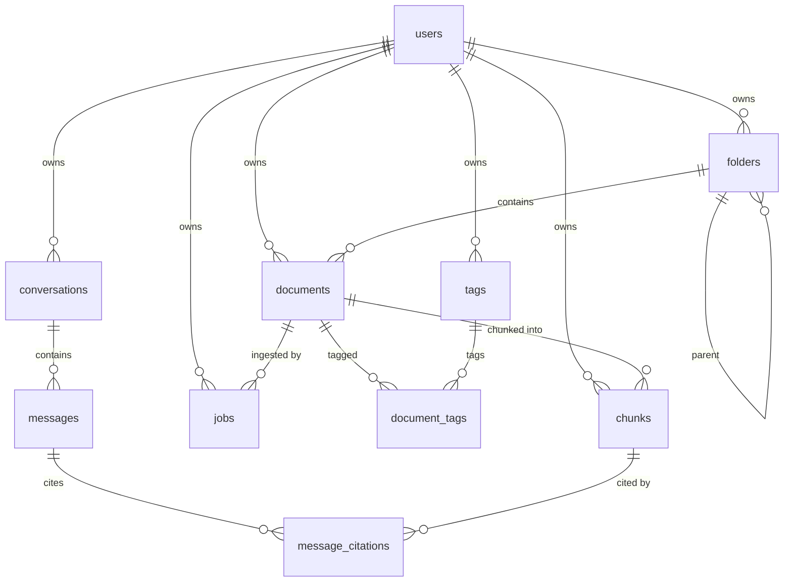

# Database

Postgres 17 with the `vector` extension. Schema is defined by SQLAlchemy models in `apps/server/app/models/` and versioned by Alembic in `apps/server/alembic/versions/`.

## Conventions

Every table except `document_tags` inherits two mixins:

- `UUIDMixin` — `id UUID PRIMARY KEY`, generated application-side via `uuid4()`
- `TimestampMixin` — `created_at`, `updated_at`, both `TIMESTAMPTZ` defaulting to `now()`

`document_tags` is a pure join table with a composite primary key.

## Schema



### users

| Column | Type | Notes |
|---|---|---|
| `email` | `VARCHAR(320)` | Unique, indexed |
| `hashed_password` | `VARCHAR(255)` | bcrypt |
| `name` | `VARCHAR(120)` | Nullable |
| `email_verified` | `BOOLEAN` | Default false. **No flow sets this yet.** |
| `theme_preference` | `VARCHAR(10)` | `system` \| `light` \| `dark` |

### documents

| Column | Type | Notes |
|---|---|---|
| `user_id` | FK → users | `ON DELETE CASCADE`, indexed |
| `folder_id` | FK → folders | `ON DELETE SET NULL`, nullable, indexed |
| `type` | `VARCHAR(20)` | `note`, `pdf`, `bookmark`, … |
| `title` | `VARCHAR(500)` | |
| `content` | `TEXT` | Extracted text; null for un-parsed binaries |
| `summary` | `TEXT` | Reserved — nothing writes it yet |
| `source_url`, `file_path` | `TEXT` | `file_path` reserved for object storage |
| `content_hash` | `VARCHAR(64)` | SHA-256, indexed. For future dedupe. |
| `ingest_status` | `VARCHAR(30)` | `pending`/`processing`/`indexed`/`skipped_empty`/`failed` |
| `starred` | `BOOLEAN` | Column exists; no endpoint toggles it |
| `deleted_at` | `TIMESTAMPTZ` | Soft delete, indexed. Non-null = trashed |

Every document query filters on `deleted_at` — trashed rows are excluded from lists, search, and retrieval.

### chunks

| Column | Type | Notes |
|---|---|---|
| `document_id` | FK → documents | `ON DELETE CASCADE`, indexed |
| `user_id` | FK → users | Denormalized so retrieval filters by owner without a join |
| `position` | `INTEGER` | Order within the document |
| `content` | `TEXT` | The chunk text |
| `embedding` | `VECTOR(768)` | Nullable until embedded |

Two specialized indexes:

```sql
CREATE INDEX ix_chunks_embedding ON chunks USING hnsw (embedding vector_cosine_ops);
CREATE INDEX ix_chunks_content_fts ON chunks USING gin (to_tsvector('english', content));
```

**The HNSW index is why embeddings are 768-dimensional.** pgvector caps HNSW at 2000 dimensions; Gemini's default output is 3072. Changing embedding provider or dimension requires a new migration altering the column type and rebuilding both the index and every stored vector.

### conversations, messages, message_citations

`conversations` holds `title` (auto-set from the first question) and a reserved `summary`. `messages` stores `role` (`user`/`assistant`) and `content`. `message_citations` links an assistant message to the chunks that grounded it, with `rank` preserving retrieval order — this is what makes every answer auditable.

### jobs

Tracks ingestion attempts: `type`, `status` (`queued`/`processing`/`completed`/`failed`, indexed), `attempts`, and `error`. Mirrors arq's queue state into Postgres so job history survives a Redis flush and is queryable via `/uploads/{id}/status`.

### folders, tags, document_tags

`folders.parent_id` self-references with `ON DELETE CASCADE` — deleting a parent removes the whole subtree. `tags` has a unique constraint on `(user_id, name)`, which is why tag creation is idempotent.

## Cascade behavior

| Deleting | Effect |
|---|---|
| A user | Removes all their folders, tags, documents, chunks, conversations, jobs |
| A document | Removes its chunks, tag links, jobs, and any citations pointing at those chunks |
| A folder | Removes child folders; sets contained documents' `folder_id` to NULL |
| A conversation | Removes its messages and their citations |

## Migrations

```bash
alembic upgrade head                      # apply
alembic revision --autogenerate -m "..."  # create after changing models
alembic downgrade -1                      # roll back one
```

`alembic upgrade head` runs automatically on API startup via `entrypoint.sh` — but **only in the API role**, so parallel workers never race on the migration lock.

`alembic/env.py` imports `app.models` for its side effect of registering every model on `Base.metadata`; autogenerate misses tables without it. It reads `DATABASE_URL_SYNC` (psycopg2), not the async URL.

Revision `0001_initial` runs `CREATE EXTENSION IF NOT EXISTS vector` before any table, and reads `settings.EMBEDDING_DIM` for the vector column width so schema and provider config cannot drift.

## Operational notes

- **No connection pool tuning.** Defaults with `pool_pre_ping=True`. Revisit when API replicas scale out — Postgres connection limits bite before CPU does.
- **No soft-delete cleanup job.** Trashed documents are never purged; [FEATURES.md](FEATURES.md) specifies a 30-day window that is not enforced.
- **`content_hash` is written but unused.** Dedupe on re-upload is not implemented.
