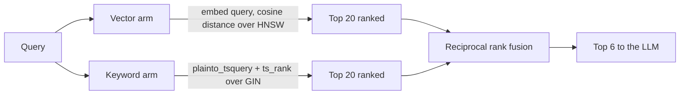

# RAG Pipeline

All parameters below are the deployed defaults from `apps/server/app/core/config.py` and are environment-overridable.

## Parameters

| Setting | Default | Meaning |
|---|---|---|
| `CHUNK_SIZE` | 800 | Target characters per chunk |
| `CHUNK_OVERLAP` | 120 | Characters carried into the next chunk |
| `RETRIEVAL_TOP_K` | 20 | Candidates fetched per retrieval arm |
| `RERANK_TOP_N` | 6 | Chunks passed to the LLM as context |
| `EMBEDDING_DIM` | 768 | Vector width — must stay ≤2000 for HNSW |

## Chunking

`app/rag/chunking.py` is paragraph-aware rather than a blind character window. It splits on blank lines and packs whole paragraphs into a chunk until adding another would exceed `CHUNK_SIZE`. Only a single paragraph that is itself oversized falls back to fixed-width splitting.

The intent is that a retrieved chunk is a coherent unit of prose. A naive fixed window cuts mid-sentence, which produces citations that read as fragments and degrades answer quality.

Overlap carries the tail of the previous chunk forward so a fact spanning a paragraph boundary is still retrievable from at least one chunk.

**Known limitation:** splitting is character-based, not token-based. A chunk of CJK text or dense code carries far more tokens than the same character count of English prose, so context size varies by content type.

## Embedding

`app/rag/embeddings.py` batches 64 texts per provider call. Gemini's `batchEmbedContents` accepts the whole batch in one request, so a 500-chunk document costs 8 API calls rather than 500.

Embeddings are requested with `outputDimensionality: 768`. The model's native output is 3072, which **cannot be HNSW-indexed** — pgvector caps that index at 2000 dimensions. This is the single most important constraint in the pipeline: changing embedding model or dimension means a migration, an index rebuild, and re-embedding every existing chunk.

Ingestion is idempotent — the task deletes a document's existing chunks before writing new ones, so retries and edits cannot leave duplicates.

## Retrieval — hybrid with reciprocal rank fusion

`app/rag/retrieval.py` runs two independent searches and fuses them.



**Why both arms.** Vector search finds semantic matches — a query about "how are vectors kept" retrieves a chunk saying "embeddings are stored in Postgres" with no shared keywords. Keyword search finds exact tokens vector search dilutes — error codes, function names, proper nouns. Each fails where the other succeeds.

**Why RRF rather than score blending.** Cosine distance and `ts_rank` are on incomparable scales; normalizing them requires tuning weights that drift with corpus and query type. RRF discards the raw scores and uses only rank position:

```
score(chunk) = Σ 1 / (k + rank)     k = 60
```

A chunk ranked highly by either arm scores well; a chunk ranked well by both scores best. No weight tuning, no scale calibration.

**Consequence for consumers:** the `score` in a `/search` response is an RRF value, not a similarity. It is only meaningful for ordering within one response — do not threshold on it or compare across queries.

Both arms filter on `user_id` and exclude trashed documents, so isolation is enforced at the query level rather than after retrieval.

## Generation

`app/rag/prompts.py` builds the request. Context chunks are numbered `[1]`, `[2]`, … and the system prompt constrains the model to three rules: answer only from the numbered context, cite every claim inline as `[n]`, and say so plainly when the context does not contain the answer.

The last six turns of conversation history are included; the current question is appended last.

Citation integrity is structural, not just prompted. The `[n]` markers correspond by position to the chunks in the `citations` SSE event, and the same chunk IDs are persisted to `message_citations`. A stored answer can always be traced back to its exact sources.

## Streaming contract

The endpoint emits `citations` before any `token` event, so a UI renders sources while the answer is still generating. On completion, the assistant message and its citation rows are persisted, then `done` carries the conversation and message IDs.

## Tuning guidance

| Symptom | Lever |
|---|---|
| Answers miss content that exists | Raise `RETRIEVAL_TOP_K`, then `RERANK_TOP_N` |
| Answers include irrelevant citations | Lower `RERANK_TOP_N` |
| Citations read as fragments | Raise `CHUNK_SIZE` |
| Facts spanning sections get missed | Raise `CHUNK_OVERLAP` |
| Ingestion too slow / rate-limited | Raise the batch size in `embeddings.py` |

## Not implemented

- **No re-ranking model.** `RERANK_TOP_N` truncates the fused list; it does not re-score with a cross-encoder. The name is aspirational.
- **No query rewriting.** The raw user question is embedded as-is — no HyDE, no multi-query expansion, no conversational rewriting, so follow-ups relying on pronouns retrieve poorly.
- **No embedding cache.** `content_hash` is stored but unused; identical content re-embeds.
- **No metadata filtering at retrieval.** Search cannot be scoped to a folder, tag, or date range despite [FEATURES.md](FEATURES.md) specifying it.
- **No conversation summarization.** History is truncated to six turns rather than compacted, so older context is simply lost.
