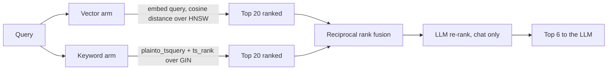

# RAG Pipeline

All parameters below are the deployed defaults from `apps/server/app/core/config.py` and are environment-overridable.

## Parameters

| Setting | Default | Meaning |
|---|---|---|
| `CHUNK_SIZE` | 200 | Target **tokens** per chunk (cl100k_base) |
| `CHUNK_OVERLAP` | 30 | Tokens carried into the next chunk |
| `RETRIEVAL_TOP_K` | 20 | Candidates fetched per retrieval arm |
| `RERANK_TOP_N` | 6 | Chunks passed to the LLM as context |
| `EMBEDDING_DIM` | 768 | Vector width — must stay ≤2000 for HNSW |

## Chunking

`app/rag/chunking.py` is paragraph-aware rather than a blind window. It splits on blank lines and packs whole paragraphs into a chunk until adding another would exceed `CHUNK_SIZE`. Only a single paragraph that is itself oversized falls back to fixed-width splitting.

The intent is that a retrieved chunk is a coherent unit of prose. A naive fixed window cuts mid-sentence, which produces citations that read as fragments and degrades answer quality.

Overlap carries the tail of the previous chunk forward so a fact spanning a paragraph boundary is still retrievable from at least one chunk.

**Sizing is token-based (`tiktoken`, `cl100k_base`), not character-based.** A raw character count treats a CJK chunk or a chunk of dense code as the same "size" as the equivalent length of English prose, when it may carry several times the tokens — `cl100k_base` isn't Gemini's or Groq's own tokenizer (neither publishes one), but it correlates with real subword tokenization far better than counting characters does. The Docker image pre-warms `cl100k_base`'s vocab file at build time (`ENV TIKTOKEN_CACHE_DIR` + a warm-up `RUN`) so chunking never depends on outbound network access at runtime, same principle as OCR being self-hosted rather than a cloud call.

## Embedding

`app/rag/embeddings.py` batches 64 texts per provider call. Gemini's `batchEmbedContents` accepts the whole batch in one request, so a 500-chunk document costs 8 API calls rather than 500.

Embeddings are requested with `outputDimensionality: 768`. The model's native output is 3072, which **cannot be HNSW-indexed** — pgvector caps that index at 2000 dimensions. This is the single most important constraint in the pipeline: changing embedding model or dimension means a migration, an index rebuild, and re-embedding every existing chunk.

Ingestion is idempotent — the task deletes a document's existing chunks before writing new ones, so retries and edits cannot leave duplicates.

**Embedding cache.** Before re-chunking, `ingest_service.run_ingest` compares a fresh SHA-256 of the content against the stored `documents.content_hash`. If they match and the document is already `indexed` with chunks present, the whole re-embed is skipped — a re-ingest triggered by an edit that didn't actually change the content (or a duplicate trigger) costs nothing against the free daily embedding quota. `content_hash` existed before this and was previously write-only.

## Retrieval — hybrid with reciprocal rank fusion

`app/rag/retrieval.py` runs two independent searches and fuses them.



**Why both arms.** Vector search finds semantic matches — a query about "how are vectors kept" retrieves a chunk saying "embeddings are stored in Postgres" with no shared keywords. Keyword search finds exact tokens vector search dilutes — error codes, function names, proper nouns. Each fails where the other succeeds.

**Why RRF rather than score blending.** Cosine distance and `ts_rank` are on incomparable scales; normalizing them requires tuning weights that drift with corpus and query type. RRF discards the raw scores and uses only rank position:

```
score(chunk) = Σ 1 / (k + rank)     k = 60
```

A chunk ranked highly by either arm scores well; a chunk ranked well by both scores best. No weight tuning, no scale calibration.

**Consequence for consumers:** the `score` in a `/search` response is an RRF value, not a similarity. It is only meaningful for ordering within one response — do not threshold on it or compare across queries.

Both arms filter on `user_id` and exclude trashed documents, so isolation is enforced at the query level rather than after retrieval. Both arms also accept an optional `SearchFilters` (type/folder/tag/date), applied as further `WHERE` clauses on `documents` — a filter can only narrow the candidate set further, never widen past owner+trash scoping. Wired to `GET /search`'s query params; chat retrieval doesn't take filters today. See [API.md](API.md).

**Re-ranking (chat only).** `app/rag/rerank.py` asks the chat LLM to re-score the RRF-fused candidates before truncating to `RERANK_TOP_N`, instead of just truncating the fused order (the previous behavior — `RERANK_TOP_N`'s name overstated it). No new provider or dependency: the same `CHAT_PROVIDER` call already used for the answer, given a numbered candidate list and asked to return relevance order. Parsing that response tolerates minor deviations (trailing punctuation) but falls back to the original RRF order — today's prior behavior — on a provider failure or a response that doesn't parse as a clean number list. `GET /search` does not re-rank; this is chat-context-selection only.

## Generation

`app/rag/prompts.py` builds the request. Context chunks are numbered `[1]`, `[2]`, … and the system prompt constrains the model to three rules: answer only from the numbered context, cite every claim inline as `[n]`, and say so plainly when the context does not contain the answer.

**Query rewriting.** Before retrieval, `chat_service._rewrite_query` asks the chat LLM to resolve pronouns and references in the question against the conversation history ("what about the second one?" → a standalone question naming what "the second one" refers to). Only runs when history is non-empty — a conversation's first message has nothing to resolve against, so it's used as-is with no extra call. A rewrite failure falls back to the raw question rather than breaking the chat; the rewritten text is used for retrieval only, never shown to the user or sent to generation in place of the real question.

**History and summarization.** The last six raw messages are included verbatim; the current question is appended last. Once a conversation grows past that window, `chat_service._update_summary` folds the aging-out messages into `conversations.summary` (an LLM call, run after the visible answer has already streamed, so it can't delay or break the response) and that summary is prepended as a system message ahead of the raw history. `conversations.summary` existed before this and was previously write-only.

Citation integrity is structural, not just prompted. The `[n]` markers correspond by position to the chunks in the `citations` SSE event, and the same chunk IDs are persisted to `message_citations`. A stored answer can always be traced back to its exact sources.

## Streaming contract

The endpoint emits `citations` before any `token` event, so a UI renders sources while the answer is still generating. On completion, the assistant message and its citation rows are persisted, then `done` carries the conversation and message IDs.

## Tuning guidance

| Symptom | Lever |
|---|---|
| Answers miss content that exists | Raise `RETRIEVAL_TOP_K`, then `RERANK_TOP_N` |
| Answers include irrelevant citations | Lower `RERANK_TOP_N` |
| Citations read as fragments | Raise `CHUNK_SIZE` |
| Facts spanning sections get missed | Raise `CHUNK_OVERLAP` |
| Ingestion too slow / rate-limited | Raise the batch size in `embeddings.py` |

## Not implemented

- **Re-ranking is LLM-based, not a dedicated cross-encoder.** A real cross-encoder (hosted rerank API like Cohere/Jina, or a local model) would likely out-perform asking a general-purpose chat model to order a list — not built, since it needs either a new external-service decision or a dependency too heavy for the free-tier shared vCPU. The LLM-based version costs nothing new and is a real improvement over blind truncation, but isn't the ceiling.
- **Chat retrieval doesn't take metadata filters.** `GET /search` does (type/folder/tag/date); the retrieval used inside `/chat` does not expose the same filters yet.
